## Business Roles and Functions

Delta production data is embedded into the WeekBasedCapacityGroup aspect model. This means that only suppliers provide delta production related data and customers consume it.

|Function / Role|Customer|Supplier|
|-|-|-|
|Solve bottleneck via pre production||X|
|Solve bottleneck via post production||X|
|Inform customer||X|
|Acknowledge that bottleneck has been solved|X||

# From Handover Document

Simulated Delta-Production is a feature that helps suppliers to manage their production capacity more effectively. It allows them to address and balance capacity shortages without having to increase their actual or maximum capacity. Suppliers can choose to use this feature, but it is not mandatory. Simulated Delta-Production covers both simulated pre-production and post-production activities. 

The main advantage of using simulated Delta-Production is that it gives suppliers a way to manage small capacity shortfalls. This can be done manually or automatically, which saves time and effort that would otherwise be spent on frequent capacity adjustments, particularly when demand is unpredictable. 

Simulated Delta-Production enables suppliers to add extra detail to their capacity information. This helps illustrate solutions for capacity issues or times when production resources might be offline. Only the end results of simulated Delta-Production are shared with the customer. Suppliers may input a simulated Delta-Production value for each week as needed (see Fig. 7 and 8 in CX-0128 DCM Standard document), which shows an increase or decrease in planned demand without actually changing the real figures. 

Context  

This information refers to Standard CX-0128 as per Rel.24.05. 

Simulated Delta-Production may be used within a Capacity Group to indicate how production can be adjusted to meet demand. It helps cover potential shortfalls by showing where goods could be produced earlier or later than currently demanded. Suppliers can provide these simulated values on a weekly basis alongside their regular capacity data. There is no need to give details about the duration of these adjustments, as this can be inferred from the number of weeks for which the simulated data is provided. 

When comparing demand and capacity data, the simulated values are considered without altering the actual data. If a simulated Delta-Production value is provided, it must be included in the weekly demand and capacity comparison. A positive value indicates a virtual increase in planned demand, while a negative value indicates a virtual decrease. 

Simulated Delta-Production must not change the material demand. It is strictly a simulation feature. 

Suppliers can use comments to provide customers with additional information about the simulated Delta-Production. For more details on this communication feature, see Chapter 5.9 in the CX-0128 DCM Standard document 

# End of Handover Document

# From Standard Document (Jupiter Preview)

5.7.2 Simulated Delta-Production (Pre-/Post-production)
5.7.2.1 Business value
Simulated Delta-Production is a feature that helps suppliers to manage their production capacity more effectively. It allows them to address and balance capacity shortages without having to increase their actual or maximum capacity. Suppliers can choose to use this feature, but it is not mandatory. Simulated Delta-Production, which covers both simulated pre-production and post-production activities.

The main advantage of using simulated Delta-Production is that it gives suppliers a way to manage small capacity shortfalls. This can be done manually or automatically, which saves time and effort that would otherwise be spent on frequent capacity adjustments, particularly when demand is unpredictable.

Simulated Delta-Production enables suppliers to add extra detail to their capacity information. This helps illustrate solutions for capacity issues or times when production resources might be offline. Only the end results of simulated Delta-Production are shared with the customer. Suppliers MAY input a simulated Delta-Production value for each week as needed (see Fig. 7 and 8), which shows an increase or decrease in planned demand without actually changing the real figures.

5.7.2.2 Definition of simulated delta-production (Pre-/post-production) in the context of capacity groups
Simulated Delta-Production MAY be used within a Capacity Group to indicate how production can be adjusted to meet demand. It helps cover potential shortfalls by showing where goods could be produced earlier or later than currently demanded. Suppliers can provide these simulated values on a weekly basis alongside their regular capacity data. There's no need to give details about the duration of these adjustments, as this can be inferred from the number of weeks for which the simulated data is provided.

When comparing demand and capacity data, the simulated values are considered without altering the actual data. If a simulated Delta-Production value is provided, it MUST be included in the weekly demand and capacity comparison. A positive value indicates a virtual increase in planned demand, while a negative value indicates a virtual decrease.

Simulated Delta-Production MUST NOT change the material demand. It's strictly a simulation feature.

Suppliers can use comments to provide customers with additional information about the simulated Delta-Production. For more details on this communication feature, see Chapter 5.9.

Visualization tips 

Below are two examples of how simulated Delta-Production might be represented visually. 

Visualized example of results of simulated Delta-Production (with pre-production) 

Visualized example of results of simulated Delta-Production (with post-production) 

# End of Standard Document (Jupiter Preview)

# Details 

Detailed definition of pre-production in the context of capacity groups 

Simulated delta-production may be the result of a simulated pre-production or post-production and may be used as a balancing option within a capacity group for one-up and one-down, where it can be simulated that goods are pre-produced (i.e. in advance) or post-produced (i.e. after) in respect to the initially demanded calendar weeks.  

The capacity deficits that trigger this simulation are defined based on the sum of the demands of a particular week compared to the "actual capacity" or optionally to the "maximum capacity" for the same week. The pre-produced or post-produced quantities must be considered as placed in a virtual stock as simulated inventory from which quantities are withdrawn to cover the demand; the same quantity must be covered later with replenishments to reduce potential shortages in the bottleneck weeks. The pre-production and post-production length is based on the number of weeks in which pre-production and post-production values are set. 

Pre-production and post-production must be distinguished accordingly within a capacity group. 

Pre-production and post-production are not changing the real customer demands since it is limited to its simulation abilities. 

## Sequence Diagram

```mermaid
sequenceDiagram
Participant c as Customer
Participant s as Supplier
rect rgb(157,93,00) 
c->>s: I need 100 blue toys each in weeks 47, 48, 49 and 50
end
s->>s: Manage Capacities
s->>s: There is a bottleneck in week 50
s->>s: It is solvable via pre-production in weeks 48 and 49  

rect rgb(64,74,00)
s-->>c: I can produce 100 in week 47, 0 in week 50 and 150 in weeks 48 and 49
s->>c: 50 each in weeks 48 und 49 are pre-produced to cover the demand in week 50
end
```

For further details, please refer to [CX-0128 Demand and Capacity Management Data Exchange][StandardLibrary].

## Notice

This work is licensed under the [CC-BY-4.0](https://creativecommons.org/licenses/by/4.0/legalcode)

- SPDX-License-Identifier: CC-BY-4.0
- SPDX-FileCopyrightText: 2023,2024 ZF Friedrichshafen AG
- SPDX-FileCopyrightText: 2023,2024 Bayerische Motoren Werke Aktiengesellschaft (BMW AG)
- SPDX-FileCopyrightText: 2023,2024 SAP SE
- SPDX-FileCopyrightText: 2023,2024 Volkswagen AG
- SPDX-FileCopyrightText: 2023,2024 Mercedes Benz Group AG
- SPDX-FileCopyrightText: 2023,2024 BASF SE
- SPDX-FileCopyrightText: 2023,2024 SupplyOn AG
- SPDX-FileCopyrightText: 2023,2024 Henkel AG & Co.KGaA
- SPDX-FileCopyrightText: 2023,2024 Fraunhofer-Gesellschaft zur Förderung der angewandten Forschung e.V (Fraunhofer)
- SPDX-FileCopyrightText: 2023,2024 Contributors to the Eclipse Foundation

[StandardLibrary]: https://catenax-ev.github.io/docs/next/standards/CX-0128-DemandandCapacityManagementDataExchange
